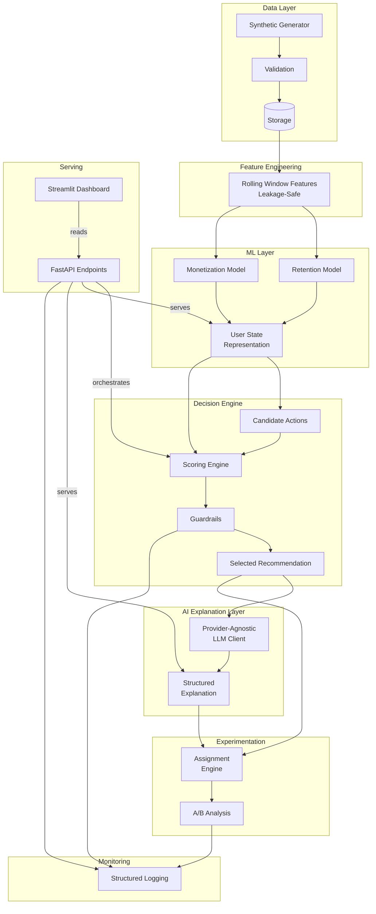

# Attention OS — System Architecture

## Overview

Attention OS is a decision intelligence platform that models user engagement state in real time, runs ML predictions, and selects optimal retention and monetization interventions. It is designed as a portfolio demonstration of production-grade ML systems thinking — from synthetic data generation through model serving, guardrail enforcement, and controlled experimentation.

---

## High-Level Architecture



---

## Component Details

### 1. Data Layer

| Component | Responsibility |
|---|---|
| **Synthetic Generator** | Produces realistic user engagement telemetry — session logs, purchase history, notification sends, and churn events — with configurable distributions and realistic temporal patterns. |
| **Validation** | Enforces schema, range, and referential integrity constraints on generated data before it reaches storage. Rejects or quarantines records that violate invariants. |
| **Storage** | Flat-file (Parquet/CSV) storage for the portfolio context; designed with a clear interface so that a production deployment could swap in a columnar warehouse or time-series database. |

**Design decisions:**
- Synthetic data is used to avoid PII concerns while still exercising every downstream component.
- The generator includes embedded causal signals (e.g., feature usage decay preceding churn) so that ML models have meaningful patterns to learn.

---

### 2. Feature Engineering Layer

Rolling-window features are computed from raw event streams with strict **leakage prevention**:

- All features at time *t* use only data from *t − W* to *t* (lookback window).
- No future labels, no future purchase events, no future session activity leaks into feature values.
- Windows are anchored per-user, not globally.

**Feature categories:**

| Category | Example Features | Rationale |
|---|---|---|
| Recency | `days_since_last_session`, `days_since_last_purchase` | Strongest single predictors of churn and conversion. |
| Frequency | `sessions_last_7d`, `sessions_last_30d`, `purchases_last_30d` | Activity volume signals engagement trajectory. |
| Intensity | `avg_session_duration_7d`, `total_screen_time_7d` | Depth of engagement, not just presence. |
| Trend | `session_trend_7d_vs_30d`, `feature_usage_slope` | Directional momentum — declining users are at higher risk. |
| Diversity | `distinct_features_used_7d`, `days_active_last_14d` | Breadth of product exploration correlates with retention. |

---

### 3. ML Layer

Two prediction models are maintained:

| Model | Target | Horizon | Use |
|---|---|---|---|
| **Retention Model** | P(does not churn within 7 days) | 7-day window | Identifies at-risk users who need intervention. |
| **Monetization Model** | P(purchase within 7 days) | 7-day window | Identifies users with conversion propensity for upsell offers. |

Both models are trained with **temporal splits** — training data strictly precedes validation data in wall-clock time. This prevents the models from memorizing future patterns that would not be available at inference time.

**Model selection** (see [modeling.md](modeling.md) for full detail):
- Logistic Regression serves as the interpretable baseline.
- Random Forest captures non-linear interactions.
- XGBoost is the primary production model, selected for calibration quality and performance.

**User State Representation** is the unified vector that feeds the decision engine. It combines:
- Raw features (the rolling-window engineered values)
- Model outputs (retention risk score, monetization propensity score)
- Metadata (user segment, days since signup, current plan tier)

This representation is computed on-demand per user and is never stale.

---

### 4. Decision Engine

The decision engine translates predictions into actionable recommendations. It is the core business logic layer.

```
Candidate Actions → Scoring → Guardrails → Selected Recommendation
```

**Key components:**

1. **Candidate Actions Catalog** — a curated set of interventions (send notification, offer discount, unlock premium trial, etc.), each with eligibility rules, estimated cost, risk level, and target population.

2. **Scoring Formula** — computes an expected value score for each eligible action:

   ```
   score = w_retention × Δ_retention + w_revenue × Δ_revenue − w_cost × cost − w_risk × risk_penalty
   ```

   Where Δ values represent the estimated marginal impact of the action on the user's retention/revenue probability.

3. **Guardrails** — hard constraints that override the scoring:
   - Notification frequency caps (max N per user per week)
   - High-value user protection (different rules for top-decile spenders)
   - No-action threshold (if no action clears the minimum expected value bar, do nothing)

4. **Harmful Optimization Avoidance** — the engine explicitly penalizes actions that exploit short-term engagement at the cost of long-term trust (e.g., excessive notification spam).

See [decision_engine.md](decision_engine.md) for the full specification.

---

### 5. AI Explanation Layer

Each recommendation is accompanied by a human-readable explanation generated by a provider-agnostic LLM client.

**Design principles:**
- **Provider-agnostic**: The client abstracts the LLM backend — it can call OpenAI, Anthropic, a local model, or return a rule-based fallback. No business logic depends on a specific provider.
- **Structured output**: Explanations are returned as structured JSON with fields for rationale, confidence, and alternative actions considered.
- **Fallback**: If the LLM is unavailable or returns an invalid response, a template-based explanation is generated using the raw scoring data. The system never degrades to "no explanation."

**Example output:**

```json
{
  "rationale": "User shows declining session frequency (−40% week-over-week) and has not purchased in 21 days. A targeted re-engagement notification has the highest expected value.",
  "confidence": 0.82,
  "alternatives_considered": ["discount_offer", "premium_trial"],
  "guardrails_applied": ["notification_cap_ok", "not_high_value_tier"]
}
```

---

### 6. Experimentation Layer

Every recommendation is assigned to an experiment variant before it is served to the user.

| Concept | Implementation |
|---|---|
| **Assignment** | Deterministic hashing of `(user_id, experiment_id)` ensures the same user always sees the same variant. No randomness at serve time — assignment is reproducible and auditable. |
| **Variants** | Each experiment defines a control group (business-as-usual or no action) and one or more treatment variants. |
| **Metrics** | Primary metrics (retention rate, revenue per user) and guardrail metrics (churn rate, notification fatigue) are tracked per variant. |
| **Analysis** | Two-sample t-tests with confidence intervals and p-values. The analysis dashboard reports whether observed differences are statistically significant. |

**Counterfactual simulation:** The system can simulate what would have happened if a different action had been taken, using the trained models as a proxy for the true response function. This is explicitly labeled as an estimate, not a causal claim.

See [experimentation.md](experimentation.md) for full detail.

---

### 7. API Layer

A FastAPI application exposes the following endpoints:

| Endpoint | Method | Purpose |
|---|---|---|
| `GET /users/{user_id}/state` | GET | Returns the full user state representation (features + model scores). |
| `GET /users/{user_id}/recommendations` | GET | Returns scored candidate actions with the selected recommendation. |
| `GET /users/{user_id}/explanation` | GET | Returns the AI-generated explanation for the selected recommendation. |
| `GET /experiments/{exp_id}/analysis` | GET | Returns A/B test results for a given experiment. |
| `POST /decisions/evaluate` | POST | On-demand decision evaluation — accepts a user ID and returns the full decision pipeline output. |

**Design notes:**
- All endpoints return structured JSON.
- The API is stateless — all computation happens per-request, reading from storage and running models in real time.
- Error responses follow a consistent schema with error codes and human-readable messages.

---

### 8. Dashboard (Streamlit)

The Streamlit dashboard is the primary human interface for exploring the system:

- **User explorer**: Select a user, view their state, features, and model scores.
- **Decision viewer**: See candidate actions, scoring breakdown, guardrails applied, and the final recommendation.
- **Explanation panel**: Renders the AI-generated explanation with fallback visibility.
- **Experiment dashboard**: Compare variants, view metrics, check statistical significance.
- **System health**: Basic monitoring indicators (last data refresh, model version, experiment status).

The dashboard calls the FastAPI backend — it does not access storage or models directly. This enforces a clean separation between presentation and logic.

---

### 9. Monitoring

Monitoring is lightweight but intentional:

| Signal | Mechanism |
|---|---|
| **Data freshness** | Timestamp of last synthetic data generation; dashboard warns if stale. |
| **Model version** | Logged alongside every prediction for auditability. |
| **Decision audit trail** | Every recommendation is logged with the full scoring breakdown, guardrails evaluated, and whether the recommendation was served. |
| **Experiment integrity** | Assignment counts per variant are tracked to detect drift or imbalance. |

---

## Cross-Cutting Concerns

### Reproducibility
- Random seeds are fixed and logged.
- Synthetic data generation is deterministic given a seed.
- Model training is fully scripted and versioned.

### Extensibility
- New candidate actions can be added to the catalog without changing the scoring engine.
- New features can be added to the feature engineering pipeline by appending to the feature registry.
- New models can be swapped in by conforming to the model interface (predict → probability).

### Production Readiness Signals
While this is a portfolio project, every component is structured as if it were heading toward production:
- Clear interfaces between layers.
- No hardcoded values — all configuration is externalized.
- Structured logging, not print statements.
- Tests for critical paths (data validation, feature computation, decision logic).

---

## Data Flow Summary

```
Synthetic Data → Validate → Store → Compute Features → Run Models
    → Build User State → Generate Candidates → Score → Apply Guardrails
    → Select Recommendation → Generate Explanation → Assign Experiment
    → Serve via API → Display in Dashboard → Log for Monitoring
```

Every step is idempotent and can be re-run without side effects. The system is designed to be explored, understood, and extended.
